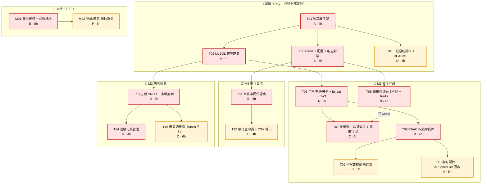
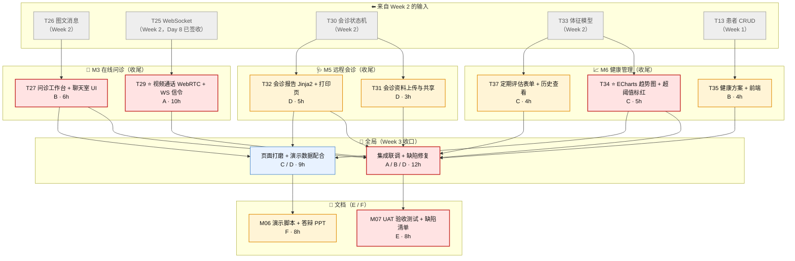

# 医生工作平台 — 任务链路图与签收标准（按周）

> 版本：v1.0 ｜ 制定日期：2026-09-10
> 上游文档：《医生工作平台-项目计划与排期.md》v1.0（WBS、依赖、工时、责任人）
> 配套文档：《医生工作平台-需求分析与初步设计.md》v0.2（范围与裁剪结论）
> 用途：**每周 Sprint 评审时逐条勾选的验收依据**。签收标准写的是"怎么算做完"，场景案例写的是"当场怎么验"。

---

## 0. 使用说明

### 0.1 优先级定义（用于链路图配色与调度决策）

| 级别 | 配色 | 定义 | 延误时的处理 |
|------|------|------|------------|
| **P0** | 🔴 红 | **关键路径**：不完成会阻塞 ≥1 个其他任务；或当周客户演示无法开场 | 立即升级，全组支援；不允许顺延 |
| **P1** | 🟡 黄 | **当周承诺**：不阻塞他人，但属于本周交付物 / 验收项 | 可日内顺延，不得跨周 |
| **P2** | 🔵 蓝 | **可顺延**：不影响当周演示主线 | 有余力再做；可整体降级 |

> 链路图配色：`P0 = 红底红边加粗` ｜ `P1 = 黄底橙边` ｜ `P2 = 蓝底蓝边`

### 0.2 签收规则

| 项 | 规则 |
|----|------|
| **谁签收** | 开发任务 T01–T37：由 **E（客户经理）** 按标准逐条核对；文档任务 M01–M07：由 **F 交叉核对 + A 抽检** |
| **双签任务** | ⭐ 核心亮点任务 **T21（医嘱校验引擎）、T29（视频通话）、T34（ECharts 趋势图）** 需 **A + E 双签** |
| **签收方式** | 场景案例必须在**演示环境实跑**，截图/录屏留证，不接受"代码写了就算" |
| **不通过处理** | 任意一条 **P0 标准**不通过 → **整任务不签收**，记入缺陷清单，Day 15 前必须闭环 |
| **争议裁决** | E 定档（必须改 / 应该改 / 可选），A 复核；仍有争议按《计划》4.2 节容量守恒规则处理 |
| **容量守恒** | 客户反馈插入的"必须改"，必须**从同模块低优先级任务或可选清单中等量移出**——签收表是移出决策的唯一依据 |

### 0.3 每条任务的固定结构

```
#### Txx · 任务名 — 负责人 · 工时 · 优先级
**依赖**：上游任务 ｜ **下游**：被谁等着
**签收标准**：可勾选的验收条目（不满足即不签收）
**签收场景案例**：S1 正向 / S2 反向，含具体操作与预期结果
```

### 0.4 演示基线数据（所有场景案例统一引用，避免各说各话）

**医生账号**

| 账号 | 姓名 | 角色 | 科室 | 用途 |
|------|------|------|------|------|
| `admin_zhang` | 张管理 | `admin` | 信息科 | 审计、用户管理、模板维护 |
| `dr_li` | 李主任 | `senior` | 心内科 | 病历审阅、会诊主导 |
| `dr_wang` | 王医生 | `junior` | 心内科 | 日常诊疗主线演示 |
| `dr_chen` | 陈医生 | `senior` | 神经内科 | **外科室**，用于临时授权 / 数据范围演示 |

**患者**

| 患者号 | 姓名 | 性别/出生 | 科室 | 过敏史 | 用途 |
|--------|------|----------|------|--------|------|
| `P20260001` | 赵大勇 | 男 / 1968-03-12 | 心内科 | **青霉素类（严重）、磺胺类（中度）** | ⭐ 过敏拦截演示 |
| `P20260002` | 钱秀英 | 女 / 1955-11-02 | 心内科 | 无 | 正常流演示 |
| `P20260003` | 孙建国 | 男 / 1972-07-30 | 神经内科 | 阿司匹林（中度） | 跨科室数据范围演示 |

**药品字典（供 T21 医嘱校验）**

| 药品 | 属性 | 常规剂量 | 触发规则 |
|------|------|---------|---------|
| 阿莫西林胶囊 | 含**青霉素类** | 0.5g tid | 对 `P20260001` → 🔴 **blocked** |
| 复方新诺明 | 含**磺胺类** | 2 片 bid | 对 `P20260001` → 🔴 **blocked** |
| 阿司匹林肠溶片 | 含**阿司匹林** | 100mg qd | 对 `P20260003` → 🔴 **blocked** |
| 呋塞米片 | 无过敏关联 | **20–40 mg/日** | 开 80mg → 🟡 **warning** |

> 基线数据由 **M05 演示数据脚本 v1** 落库。Week 2 及之后的场景案例均假设该脚本已执行。

---

## 1. Week 1（Day 1–5）· Sprint 1 — 目标：能登录、能看患者、操作被记录

### 1.1 任务链路图



**读图要点**

- **T01 是唯一的绝对起点**：A 必须在 Day 1 上午完成，否则 B/C/D 全线空转。这是本周最大单点风险。
- **三条主干并行**：`T02→T05→T07`（登录）、`T03→T11→T12`（审计）、`T02→T13→T14/T15`（患者）。三条链彼此只通过 T01/T02 耦合，Day 2 起可完全并行。
- **T13 是跨周枢纽**：本周看似只是"患者列表"，但它同时是 Week 2 的 T17/T20/T30/T33 与 Week 3 的 T35 的上游——**T13 延误一天，Week 2 有 5 个任务同时推迟**。
- **T14 提前于本周交付**：它同时是 Week 2 ⭐T21 过敏拦截引擎的输入，不能顺延。

### 1.2 关键路径与并行窗口

| 链路 | 路径 | 最早完成 | 说明 |
|------|------|---------|------|
| **主关键路径** | T01 → T02 → T05 → T07 | Day 3 末 | 决定"能不能登录"，是 Day 5 演示的开场 |
| 次关键路径 A | T01 → T02 → T13 → T14 | Day 4 | 决定患者数据 + 过敏，喂给 Week 2 的 T21 |
| 次关键路径 B | T01 → T03 → T11 → T12 | Day 4 | 决定审计可演示 |

| 并行窗口 | 时段 | 内容 |
|---------|------|------|
| 窗口 1 | Day 1 下午 | B 做 T03（不依赖数据库）、D 做 T04、F 做 M01 —— A 独占 T01→T02 |
| 窗口 2 | Day 2–3 | B 走 `T06/T08/T09/T11`，D 走 `T13/T14`，C 走 `T07/T12/T15`（Mock 先行），互不阻塞 |
| 窗口 3 | Day 4–5 | C 把 Mock 切真接口；E 准备演示脚本；全员自测 |

### 1.3 逐任务签收标准

#### T01 · 项目脚手架：FastAPI 骨架 + Vue3 骨架 + Git 分支规范 — A · 4h · P0

**依赖**：—（全组唯一绝对起点） ｜ **下游**：T02、T03、T04（全部）

**签收标准**
1. `backend/` 可用 `uvicorn app.main:app --reload` 启动，`GET /docs` 返回 200 且能看到 Swagger UI。
2. `frontend/` 可用 `npm run dev` 启动，浏览器打开首页无控制台报错（允许空壳页面）。
3. 后端按业务分包 `app/modules/{auth,patient,consult,emr,meeting,health,audit}`，每包含 `router.py` / `schemas.py` / `service.py` 占位文件。
4. `.env.example` 覆盖全部配置项（MySQL / Redis / SMTP / JWT_SECRET / AES_KEY）；`config.py` 用 pydantic-settings 加载，**缺关键配置时启动即报错**，不在运行中才崩。
5. Git 分支规范落地并写入 README：`main`（可运行）/ `dev`（集成）/ `feat/Txx-简述`（任务分支）；PR 模板强制引用任务 ID。

**签收场景案例**
- **S1 正向 — 全新环境拉起**：克隆仓库 → `cp .env.example .env` → 启动后端 → 打开 `/docs` 出现 Swagger → 启动前端 → 页面出现平台标题空壳 → **四项全绿，T01 签收**。
- **S2 反向 — 配置缺失**：删除 `.env` 中的 `JWT_SECRET` → 启动后端 → **必须立即抛配置校验错误并退出**，而不是启动成功、等到签发 token 时才崩。若静默启动 → 不签收。

---

#### T02 · MySQL 建库建表 + Alembic 迁移 — A · 4h · P0

**依赖**：T01 ｜ **下游**：T05、T13、T18（Week 2）

**签收标准**
1. Alembic 生成初始迁移，覆盖 `user` / `role` / `department` / `patient` / `allergy` / `medical_history` / `patient_group` / `group_member` / `audit_log`；空库执行 `alembic upgrade head` 一次成功。
2. `alembic downgrade base` 可无损回滚，再次 `upgrade head` 结果一致（可重复执行、幂等）。
3. 关键约束到位：`user.username` 唯一、`patient.patient_no` 唯一索引、`patient.department` 非空、外键均定义明确的 ON DELETE 策略。
4. `phone_enc` / `id_card_enc` 为加密字段（非明文）；提供 SQL 脚本把 `audit_log` 的 UPDATE / DELETE 权限从业务账号回收（供 T11 演示防篡改）。
5. seed 脚本可写入 1 个 admin + 2 个科室，供联调使用。

**签收场景案例**
- **S1 正向 — 迁移幂等**：空库 → `upgrade head` → `SHOW TABLES` 出现 9 张表 → `downgrade base` → 表全部清空 → 再 `upgrade head` → 表结构与第一次完全一致（用 `mysqldump --no-data` 比对两次输出 diff 为空）。
- **S2 反向 — 防篡改**：以**业务账号**（非 root）执行 `UPDATE audit_log SET action='x' WHERE id=1` → **被拒绝**（权限不足）；执行 `DELETE FROM audit_log` → 同样被拒绝。若成功 → T02 与 T11 均不签收。

---

#### T03 · Redis 接入 + 配置管理 + 统一响应/异常封装 — B · 3h · P0

**依赖**：T01 ｜ **下游**：T06、T11、T25（Week 2）、T36（Week 2）

**签收标准**
1. `GET /health` 返回 `{code:0, data:{db:"ok", redis:"ok"}}`；**Redis 断连时仍返回 200 且标识 `redis:"down"`，不得 500 崩溃**。
2. 统一响应结构 `{code, message, data}` 覆盖所有接口；全局异常处理器分三档（业务异常 / 参数校验 422 / 未捕获 500）返回同构结构。
3. 分页依赖统一为 `page` / `size`（默认 1 / 20），返回 `{items, total, page, size}`。
4. 敏感项（JWT_SECRET / AES_KEY / SMTP 密码）仅从 `.env` 读取，不进 Git、不进日志。
5. Redis 连接池复用，提供 `get_redis()` 依赖注入，供 T06/T25 直接调用。

**签收场景案例**
- **S1 正向 — 健康检查**：正常启动 → `/health` 双 ok → `docker stop redis` → 再次 `/health` → 仍 200 且 `redis:"down"`，登录以外接口不受影响 → 重启 redis → 恢复 ok。
- **S2 反向 — 响应同构**：请求不存在的路径 → 返回 `{code:404, message:"...", data:null}`；POST 缺必填字段 → 422 且 `message` 指出具体字段名（而非返回 HTML 错误页）。

---

#### T04 · 一键启动脚本 + README — D · 3h · P1

**依赖**：T01 ｜ **下游**：无（但为 Day 5 交付物 #9）

**签收标准**
1. 一条命令拉起 MySQL + Redis + backend + frontend（Linux/macOS `scripts/dev.sh`，Windows `scripts/dev.ps1`）；**全新机器 10 分钟内跑通**。
2. 脚本具备前置检查（docker / python / node 是否存在），缺失时打印明确指引并以非 0 退出码退出，不静默失败。
3. README 含：依赖版本表、环境变量说明表、启动/停止命令、目录结构、常见问题 ≥3 条。
4. 部署说明覆盖：uvicorn + nginx 最小可用配置片段、以及 `mysqldump` 备份脚本。

**签收场景案例**
- **S1 正向 — 新人自助**：找一名未参与配置的同学克隆仓库 → 只执行脚本一条命令 → 浏览器可打开 `/docs`（Week 1 后应能打开登录页）→ 全程无需口头指导即算通过。
- **S2 反向 — 缺失依赖**：在未安装 docker 的机器执行脚本 → 应打印"未检测到 docker，请先安装"并退出码非 0，而不是卡在超时或报一堆栈。

---

#### T05 · 用户/角色/部门模型 + bcrypt + JWT 签发校验 — A · 5h · P0

**依赖**：T02 ｜ **下游**：T07、T08

**签收标准**
1. 密码 bcrypt 加盐哈希入库，**明文不落库、不落日志**。
2. `POST /api/auth/login` 校验账号密码通过后**返回一次性 `ticket`（5 分钟有效），不直接签发 JWT**——两步式是 2FA 的前提。
3. `POST /api/auth/verify-code` 校验通过后签发 JWT（有效期 2h），payload 含 `user_id` / `title` / `department` / `jti`。
4. `POST /api/auth/logout` 把 `jti` 写入 Redis 黑名单；黑名单内 token 再请求一律 401。
5. 无 token → 401、过期 → 401、黑名单 → 401，**三者的 `message` 可区分**；`status=disabled` 的用户即使持有有效 token 也被拒绝。

**签收场景案例**
- **S1 正向 — 完整 2FA**：`admin_zhang` + 正确密码 → 返回 `ticket` 且邮箱收到验证码 → 提交正确码 → 返回 JWT → 带 JWT 调 `GET /api/me` → 返回用户信息（含 department=信息科、title=admin）。
- **S2 反向 — 登出失效**：登录成功后立即 logout → 用同一 JWT 调 `/api/me` → 401 且 message 为"凭证已失效"；另用**错误密码连续 5 次** → 返回锁定/限流提示（不得无限制重试）。

---

#### T06 · 邮箱验证码（SMTP 发送 + Redis 5 分钟有效） — B · 4h · P0

**依赖**：T03 ｜ **下游**：T07（可 Mock，但真码影响 Day 5 演示可信度）

**签收标准**
1. 触发后目标邮箱 **60 秒内**收到 6 位数字码；码存 Redis，key 含 user_id，**TTL = 300s**。
2. 5 分钟后提交同一码 → 失败并提示"验证码已过期"；同一码**使用一次后立即失效**，二次提交失败。
3. 60 秒内重复请求发送 → 被限流拒绝并返回剩余等待秒数；单账号单日发送上限（建议 20 次）。
4. SMTP 配置走 `.env`；SMTP 不可用时返回明确错误、不吞异常，且前端不会卡在无限等待（有超时）。
5. 验证码**不出现在任何响应体与日志中**（测试环境可开关打印，生产默认关闭）。

**签收场景案例**
- **S1 正向 — 生命周期**：触发发送 → 收邮件 → 立即提交 → 通过；等到 5 分 10 秒再提交同一码 → "验证码已过期"；重新发送 → 新码通过 → 旧码再提交 → 失败。
- **S2 反向 — 限流与不泄露**：连点两次"发送验证码" → 第二次返回"请 45 秒后重试"；抓包查看发送接口响应 → **响应体中不应含验证码明文**。

---

#### T07 · 登录页 + 验证码页 + Token 存储 + 路由守卫 — C · 5h · P0

**依赖**：T05（JWT 接口）、T06（验证码接口，可 Mock） ｜ **下游**：全部前端页面（所有 UI 任务的入口）

**签收标准**
1. 未登录访问 `/patient`、`/audit` 等受保护路由 → 自动跳转 `/login`，**登录后跳回原目标页**。
2. Token 存 Pinia + 本地持久化，**刷新页面不丢**；响应拦截器捕获 401 后统一清 token 并跳登录。
3. 菜单与按钮按角色渲染：`junior` 看不到"病历审阅""审计日志""用户管理"入口。
4. 验证码页有**倒计时与"重新发送"**，倒计时期间按钮禁用，倒计时结束才可重发。
5. 表单校验（账号/密码必填）与错误提示走统一 message 组件，不用 `alert`。

**签收场景案例**
- **S1 正向 — 守卫与回跳**：地址栏直接输入 `/audit` → 跳登录 → 以 `admin_zhang` 登录 → 回跳 `/audit` 并正常显示；换 `dr_wang` 登录 → `/audit` 显示 403 无权限页（**不是白屏、不是菜单里还有入口**）。
- **S2 反向 — 过期处理**：手动把 localStorage 中的 token 改成过期值 → 刷新 → 自动跳登录并提示"登录已过期"；再点"重新发送"→ 倒计时期间按钮为禁用态。

---

#### T08 · RBAC 权限中间件（3 角色权限矩阵 + 接口鉴权） — B · 4h · P0

**依赖**：T05 ｜ **下游**：T09、T10

**签收标准**
1. 权限矩阵**声明式**配置（角色 × 资源 × 操作），代码中**无散落的 `if role == ...` 硬判断**。
2. 越权访问返回 **403**，message 指明缺少的权限；**资源不存在返回 404、存在但无权返回 403**（不泄露资源存在性）。
3. 至少覆盖 5 类受保护资源：患者读写（3 角色）、病历审阅（仅 senior）、审计查询（仅 admin）、用户管理（仅 admin）、模板维护（仅 admin）。
4. 所有写接口默认需鉴权；匿名白名单**显式声明且仅含** `login` / `verify-code` / `health`。
5. 提供 3 角色 × 5 接口 = 15 组合的**期望结果表**，可脚本化回归。

**签收场景案例**
- **S1 正向 — 15 组合核对**：用 `dr_wang`（junior）调 `POST /api/emr/records/{id}/review` → 403；换 `dr_li`（senior）调同一接口 → 200。逐格对照期望结果表，15/15 一致才签收。
- **S2 反向 — 不泄露存在性**：`dr_wang` 调 `GET /api/patients/P20260003`（神经内科患者）→ **404**（不是 403）；`admin_zhang` 调同一接口 → 200。若返回 403 → 说明泄露了"该患者存在"，不签收。

---

#### T09 · 数据范围过滤（按 department 过滤，admin 豁免） — B · 3h · P1

**依赖**：T08 ｜ **下游**：T10 在其基础上开例外；Week 2 全部患者查询接口

**签收标准**
1. 患者列表 / 详情接口**默认按当前用户 department 过滤**；`admin` 不受限。
2. 跨科室访问返回 **404**（与 T08 口径一致），不返回 403。
3. 过滤逻辑在 **service 层统一入口**实现，不是每个路由各写一遍；新增患者查询必须走该入口（代码评审项）。
4. 预留 `temp_grant` 例外放行钩子（Week 1 可为空实现，T10 填充）。
5. 提供校验脚本：某科室医生可见患者数 == 库中该科室患者数。

**签收场景案例**
- **S1 正向 — 科室隔离**：`dr_wang`（心内科）查患者列表 → 只出现 `P20260001`、`P20260002`，**不含** `P20260003`；查 `P20260003` 详情 → 404。`admin_zhang` 查同一接口 → 3 名患者全部可见。
- **S2 反向 — 变更生效**：在库中把 `dr_wang` 的 department 改为神经内科 → 重新登录 → 可见集合随之变为 `P20260003` → 证明过滤是动态读 department，而非硬编码。

---

#### T10 · 临时授权 temp_grant + APScheduler 过期自动回收 — A · 5h · P1

**依赖**：T08（T09 提供过滤入口） ｜ **下游**：Week 2 T30 会诊（自动建授权）、流程 2 演示

**签收标准**
1. `temp_grant(grantee_id, patient_id, reason, expire_at, is_valid)` 建表 + CRUD 接口；仅 `admin` / `senior` 可发起。
2. APScheduler 每分钟扫描 `expire_at < now() AND is_valid = 1` → 置 `is_valid = 0`；任务**随应用启动注册一次，不重复注册**（多 worker 场景明确说明）。
3. 授权有效期内，被授权人**可跨科室访问该患者**（覆盖 T09 过滤）；到期后访问回落为 404。
4. 授权的**创建**与**自动回收**两条动作均写入审计日志。
5. 提供"手动立即失效"接口（会诊结束后回收，供 Week 2 T30 调用）。

**签收场景案例**
- **S1 正向 — 授权生效与到期**：`admin_zhang` 给 `dr_chen`（神经内科）授权 `P20260001` 有效期 24h → `dr_chen` 立刻可查看该患者详情（原为 404）；再手动把 `expire_at` 改为 1 分钟后 → 等 90 秒 → `dr_chen` 再访问 → **404**。
- **S2 反向 — 留痕**：审计日志中能查到 `temp_grant.create` 与 `temp_grant.expire` 两条记录，且 `expire` 记录的 `created_at` 落在预期的一分钟扫描窗口内。查不到 → 不签收。

---

#### T11 · 审计中间件（写操作 + 敏感查询埋点） — B · 4h · P0

**依赖**：T03 ｜ **下游**：T12

**签收标准**
1. 所有 POST / PUT / PATCH / DELETE **自动记录**：`user_id`、`created_at`、`ip`、`method`、`path`、语义化 `action`、`object_type` / `object_id`、`result`（成功/失败）。
2. 敏感读操作**手动埋点**：患者详情查看、病历详情查看、审计日志导出。
3. 日志写入失败**不影响主业务**（异常吞掉 + 告警），主流程不得因日志报错而回滚或 500。
4. 日志表只 INSERT；业务 DB 账号对 `audit_log` **无 UPDATE / DELETE 权限**（SQL 脚本由 T02 提供）。
5. 每条日志带**语义化 action**（如 `patient.view`、`patient.create`），而非只有 URL。

**签收场景案例**
- **S1 正向 — 埋点覆盖**：`dr_wang` 查看 `P20260001` 详情 → 新增一条 `patient.view`（含 object_id=P20260001）；再新建一个患者 → 新增 `patient.create`，`object_id` 为新患者 ID，两条 `ip`、`result` 均正确。
- **S2 反向 — 只插不改**：以业务账号执行 `DELETE FROM audit_log WHERE id=1` → 被拒绝；执行 `UPDATE audit_log SET result='success'` → 被拒绝。另：临时让 Redis/日志库不可用时创建患者 → **患者仍创建成功**（日志失败不阻断业务）。

---

#### T12 · 审计查询页（用户/时间/操作类型）+ CSV 导出 — C · 4h · P1

**依赖**：T11 ｜ **下游**：无（Day 5 演示项之一）

**签收标准**
1. 支持 **用户 / 时间范围 / 操作类型** 三条件组合查询，结果分页，默认按时间倒序。
2. CSV 导出**与当前筛选条件一致**（不是导出全表）；文件名含时间范围；**UTF-8 BOM** 使 Excel 打开不乱码。
3. 非 `admin` **既看不到菜单项、接口也返回 403**（双保险，不能只靠隐藏菜单）。
4. 单表 ≥1000 条时查询响应 < 2s（需建索引：`user_id`、`created_at`、`action`）。
5. 列表行可展开查看 `detail` 原文（含关键字段值）。

**签收场景案例**
- **S1 正向 — 筛选与导出一致**：筛选"王医生 + 今天 + `patient.view`" → 列表剩 N 条 → 导出 CSV → Excel 打开**无乱码**，行数 == N，时间范围与筛选一致。
- **S2 反向 — 越权**：`dr_wang` 登录后在地址栏直接输入 `/audit` → 403 无权限页；打开浏览器 Network 面板确认接口返回 403 **且响应中不含任何日志数据**。若接口返回了数据只是前端没显示 → 不签收（安全缺陷）。

---

#### T13 · 患者 CRUD 后端 + 多维搜索（姓名/ID/症状标签/入院日期） — D · 6h · P0

**依赖**：T02 ｜ **下游**：T14、T15（本周）；**T17、T20、T30、T33（Week 2）；T35（Week 3）** —— 跨周枢纽

**签收标准**
1. 患者 CRUD 接口齐全；`patient_no` 系统生成且唯一；删除策略明确（软删或级联，写进接口文档）。
2. 组合搜索支持：姓名模糊、`patient_no` 精确、`symptom_tags` 标签匹配、入院日期区间，**四条件可任意 AND 组合**。
3. 分页返回 `{items, total}`；默认按 `created_at` 倒序。
4. 手机号 / 身份证 **AES 加密存储**，API 返回**脱敏**（`138****1234`）。
5. Swagger 中字段有中英文说明、有示例值（供 M03 直接导出）。

**签收场景案例**
- **S1 正向 — 四条件组合**：搜"赵" + 症状标签"胸痛" + 入院日期 2026-08-01~2026-09-01 → 命中 `P20260001`，`total = 1`；只留"赵" → 结果包含全部赵姓患者；四条件全空 → 返回全量分页。
- **S2 反向 — 脱敏与校验**：新建患者不填姓名 → 422 且 message 指明字段名；查询返回体中 `phone` 为 `138****1234` 而非明文；直接查库确认 `phone_enc` 为密文。

---

#### T14 · 过敏记录管理 + 详情页红色警示条 — D · 4h · P0

**依赖**：T13 ｜ **下游**：Week 2 T16（详情页）、⭐T21（过敏拦截引擎）—— **不可顺延**

**签收标准**
1. 过敏记录 CRUD 挂在患者下，字段含 `allergen`、`allergy_type`、`severity`、`recorded_at`。
2. 患者详情接口**返回过敏列表**，同时供前端警示条与 T21 校验引擎消费（同一数据源，不各查各的）。
3. 过敏原**字典化**，至少覆盖：青霉素类、磺胺类、头孢类、阿司匹林、造影剂；支持自定义补充。
4. 过敏记录的增 / 删 / 改**均写审计**；删除患者时过敏记录的级联策略明确。
5. 提供标准化函数 `get_patient_allergens(patient_id)` 供 T21 直接调用（**契约先于实现**）。

**签收场景案例**
- **S1 正向 — 警示条联动**：给 `P20260001` 添加"青霉素类 / 严重""磺胺类 / 中度" → 患者详情接口返回两条 → 前端顶部**红色警示条**显示"⚠ 过敏：青霉素类（严重）、磺胺类（中度）"。
- **S2 反向 — 删除留痕**：删除"磺胺类"那条 → 警示条只剩"青霉素类" → 审计日志中存在 `allergy.delete` 记录且含被删过敏原名称。

---

#### T15 · 患者列表页（搜索表单 + 分页 + 表格，先 Mock 后对接） — C · 6h · P1

**依赖**：T13（契约） ｜ **下游**：Week 2 T16（详情页跳转落点）

**签收标准**
1. 页面含搜索表单（姓名 / 患者号 / 症状标签 / 入院日期）、分页、表格；表格列至少含：患者号、姓名、性别/年龄、科室、主要症状、操作。
2. **Mock 先行**：Mock 数据结构与 Swagger 契约**字段级一致**，切换到真接口只改开关/baseURL，不改组件代码。
3. **空态 / 加载态 / 错误态**三态齐全；500 条数据下翻页 < 1.5s。
4. 点击行可跳转患者详情（Week 2 由 T16 承接，本周允许"建设中"占位）。
5. 列表与详情中的手机号**脱敏展示**。

**签收场景案例**
- **S1 正向 — 搜索与翻页**：输入"赵"回车 → 表格 1 行；清空 → 恢复全量；翻到第 2 页后再搜"钱" → **自动回到第 1 页**且结果为钱秀英 1 条。
- **S2 反向 — 容错**：停掉后端 → 列表显示"加载失败，点击重试"而非白屏/无限 loading；点重试后恢复 → 后端停掉期间，页面不应出现未捕获异常（控制台无红色报错）。

---

#### M01 · 需求规格说明书定稿 + 验收标准 — E · 8h · P0

**依赖**：— ｜ **下游**：M02（原型依据）；**本文档（T01–T37 / M02–M07 的签收标准被纳入规格书）**

**签收标准**
1. 覆盖 8 个部分（M1–M6、M8、基建）的功能点清单，**每条可追溯**到 PPT 原始要点或明确的裁剪结论。
2. **明确写出 6 条去除项及答辩口径**：医生社区、会话自动录像、短信验证码、人脸识别、IoT 采集、企业级监控面板。
3. 含**角色 × 权限矩阵表**（admin / senior / junior × 核心操作）。
4. **含验收标准本体**——即本文档的签收标准被纳入规格书（形成"标准写在规格里、验收照规格走"的闭环）。
5. 非功能需求**量化**：登录 < 2s、列表查询 < 1.5s、密码 bcrypt、手机号/身份证加密存储并脱敏展示。

**签收场景案例**
- **S1 正向 — 一致性抽查**：随机抽 3 名开发，各自凭规格书复述自己模块的验收标准 → 与本文档逐条一致（允许措辞不同、不允许条目缺失）。
- **S2 反向 — 裁剪可答辩**：模拟客户提问"为什么不做人脸识别/短信验证" → E 能直接翻到规格书对应章节一句话答复，且口径与《计划》3.2 节完全一致。

---

#### M02 · 原型：登录 / 患者列表 / 患者详情 线框图 — F · 8h · P1

**依赖**：M01 ｜ **下游**：C 的 T07 / T15 / Week2 T16

**签收标准**
1. 三张线框：登录页、患者列表页、患者详情页；标注**字段名、按钮、三种状态**（空 / 加载 / 错误）。
2. 患者详情页**明确标出过敏红色警示条的位置与文案**。
3. 线框字段名 / 类型**与 Swagger 契约一致**，前端可照做无需再确认。
4. 评审通过：A / B / C / D 四人确认无歧义（口头 + 文档记录）。

**签收场景案例**
- **S1 正向 — 零返工**：C 拿原型直接开工 T15，实现完成后对照原型，**实质性返工 ≤ 2 处**（仅允许微调间距/文案）。
- **S2 反向 — 反馈留痕**：客户看原型指出"患者详情缺少既往史时间线" → 记入《客户反馈跟踪表》反馈 1，Day 6 晨会由 E 定档（必须改 / 应该改 / 可选），不得口头答应后无记录。

---

### 1.4 Week 1 签收结论表（Day 5 客户评审后立即填写）

| ID | 任务 | 负责 | P | 签收人 | 通过 | 缺陷/挂起项 |
|----|------|------|---|--------|------|-----------|
| T01 | 项目脚手架 | A | P0 | E | ☐ | |
| T02 | MySQL 建库建表 | A | P0 | E | ☐ | |
| T03 | Redis/配置/响应封装 | B | P0 | E | ☐ | |
| T04 | 一键启动脚本 + README | D | P1 | E | ☐ | |
| T05 | 用户/角色/bcrypt/JWT | A | P0 | E | ☐ | |
| T06 | 邮箱验证码 | B | P0 | E | ☐ | |
| T07 | 登录页 + 路由守卫 | C | P0 | E | ☐ | |
| T08 | RBAC 权限中间件 | B | P0 | E | ☐ | |
| T09 | 科室数据范围过滤 | B | P1 | E | ☐ | |
| T10 | 临时授权 + 自动回收 | A | P1 | E | ☐ | |
| T11 | 审计中间件 | B | P0 | E | ☐ | |
| T12 | 审计查询页 + CSV | C | P1 | E | ☐ | |
| T13 | 患者 CRUD + 多维搜索 | D | P0 | E | ☐ | |
| T14 | 过敏记录 + 警示条 | D | P0 | E | ☐ | |
| T15 | 患者列表页 | C | P1 | E | ☐ | |
| M01 | 需求规格 + 验收标准 | E | P0 | F + A | ☐ | |
| M02 | 线框原型 | F | P1 | A + C | ☐ | |

**本周 P0 任务 11 个，全部通过方可进入客户评审演示；任一 P0 未签收，Day 6 晨会必须给出移出方案（容量守恒）。**

---

## 2. Week 2（Day 6–10）· Sprint 2 — 目标：EMR 全流程闭环（患者完整 + 医嘱拦截 + 审阅归档）

### 2.1 任务链路图

```mermaid
flowchart TD
  subgraph W1["⬅️ 来自 Week 1 的输入"]
    T13["T13 患者 CRUD<br/>（Week 1 已签收）"]
    T14["T14 过敏记录<br/>（Week 1 已签收）"]
    T03["T03 Redis/配置<br/>（Week 1 已签收）"]
    T02["T02 建库建表<br/>（Week 1 已签收）"]
  end

  subgraph M4["⭐ M4 电子病历（本周主战场）"]
    T18["T18 病历模板 + 2 个预置模板<br/>A · 5h"]
    T19["T19 病历 CRUD + 版本管理<br/>A · 6h"]
    T24["T24 审阅流程 + 归档只读锁定<br/>A · 5h"]
    T20["T20 医嘱模型 + 开立/修改/停用<br/>B · 5h"]
    T21["T21 ⭐ 医嘱校验引擎<br/>过敏拦截 + 剂量警告<br/>A · 5h"]
    T22["T22 病历编辑器前端<br/>选模板→动态表单<br/>C · 7h"]
    T23["T23 医嘱前端 + 校验提示弹窗<br/>C · 5h"]
  end

  subgraph M2B["🏥 M2 患者（补全）"]
    T16["T16 患者详情页<br/>C · 5h"]
    T17["T17 患者分组<br/>D 后端 + C 前端 · 6h"]
  end

  subgraph M3B["💬 M3 问诊（后端先建）"]
    T25["T25 WebSocket 服务 + 会话模型<br/>B · 6h"]
    T26["T26 图文消息 + 图片存储<br/>B · 4h"]
    T28["T28 问诊记录中心 + CSV<br/>D · 4h"]
  end

  subgraph OTH["🔧 M5 / M6 后端 + 文档"]
    T30["T30 会诊模型 + 状态机<br/>D · 4h"]
    T33["T33 体征模型 + 阈值判定<br/>D · 4h"]
    T36["T36 自动提醒 + 红点<br/>B · 5h"]
    M03["M03 数据库设计 + 接口文档<br/>F · 6h"]
    M04["M04 Sprint1 验收 + 原型细化<br/>E · 8h"]
    M05["M05 演示数据脚本 v1<br/>E + F · 4h"]
  end

  subgraph W3["➡️ Week 3 的下游（本周不交付，但被本周阻塞）"]
    T27["T27 问诊工作台<br/>（Week 3）"]
    T29["T29 ⭐ 视频通话<br/>（Week 3）"]
    T31["T31 会诊资料<br/>（Week 3）"]
    T32["T32 会诊报告<br/>（Week 3）"]
    T34["T34 ⭐ ECharts 趋势图<br/>（Week 3）"]
    T37["T37 定期评估<br/>（Week 3）"]
  end

  T02 --> T18
  T18 --> T19
  T18 --> T22
  T19 --> T24
  T13 --> T20
  T13 --> T17
  T13 --> T30
  T13 --> T33
  T14 --> T16
  T14 --> T21
  T20 --> T21
  T21 --> T23
  T03 --> T25
  T03 --> T36
  T25 --> T26
  T25 --> T28
  T30 --> T31
  T30 --> T32
  T33 --> T34
  T33 --> T37
  T26 --> T27
  T25 --> T29

  classDef p0 fill:#ffe3e3,stroke:#c62828,stroke-width:2px,color:#111
  classDef p1 fill:#fff4d6,stroke:#e08a00,stroke-width:1.5px,color:#111
  classDef p2 fill:#e8f2ff,stroke:#1565c0,stroke-width:1px,color:#111
  classDef done fill:#eeeeee,stroke:#888,stroke-width:1px,color:#555
  classDef future fill:#f5f5f5,stroke:#bbb,stroke-dasharray:5,color:#777
  class T18,T19,T20,T21,T22,T23,T24,T25,T26,T30,T33 p0
  class T16,T17,T28,T36,M03,M04,M05 p1
  class T13,T14,T03,T02 done
  class T27,T29,T31,T32,T34,T37 future
```



**读图要点**

- **本周是全局最紧的一周**：18 个任务、76 标称工时，其中 **11 个 P0**。
- **T21 是本周的收敛点**：它同时吃 `T14`（Week 1 过敏）和 `T20`（本周医嘱）两条输入，又同时喂 `T23`（前端弹窗）和流程 1 的核心演示瞬间。**T21 延误 = Day 10 客户评审没有可看的亮点**。
- **T18 是 M4 的唯一入口**：T18 一延，`T19 / T22 / T24` 三个任务同时停摆。A 必须在 Day 6 上午完成 T18。
- **T25 是跨周枢纽（与 T13 同级）**：`T26 / T28 / T27 / T29` 四个任务挂在它下面，其中 T29（10h 视频）是全局最大单点风险。**T25 必须在 Day 8 前签收**，否则 Week 3 第一天 A 就无事可做。
- ⚠️ **C 的负荷告警**：C 本周 `T16(5) + T17前端(3) + T22(7) + T23(5) = 20h`，加上会议与反馈**已超 17h 可用量约 1.5–3h**。Day 6 晨会必须先处理（见 2.2 节）。
- ⚠️ **保险丝 R3**：若 Day 9 时发现 M4 估时不足，依次降级——① T18 预置模板 2 个 → 1 个；② T22 动态表单渲染 → 静态表单。**先砍这两处，不要砍 T21**。

### 2.2 关键路径与并行窗口

| 链路 | 路径 | 最早完成 | 说明 |
|------|------|---------|------|
| **主关键路径** | T18 → T19 → T24 | Day 9 | 病历"书写 → 版本 → 审阅归档"主干 |
| 亮点路径 | T14(W1) + T20 → T21 → T23 | Day 9 | ⭐ 过敏拦截弹窗，Day 10 评审的**头号演示点** |
| 次关键路径 | T03(W1) → T25 → T26 | Day 9 | 决定 Week 3 的 T27 / T29 能否开工 |

| 并行窗口 | 时段 | 内容 |
|---------|------|------|
| 窗口 1 | Day 6 | A 独占 T18；B 并行 T20；D 并行 T30/T33；C 并行 T16（依赖 Week1 的 T14） |
| 窗口 2 | Day 7–8 | A 走 `T19 → T21 → T24`；B 走 `T25 → T26 → T36`；C 走 `T22 → T23`；D 走 `T28` |
| 窗口 3 | Day 9–10 | 前后端对联：**T23 接 T21**、**T22 接 T19**；E 走 M05 演示数据；全员自测流程 1 |

> **C 的负荷处置（Day 6 晨会必议）**，三选一：
> ① T17 前端部分（3h）改由 D 承担（D 本周 15h，有余量）；
> ② T16 患者详情页延到 Week 3（会削弱"患者档案完整"的 Day 10 交付）；
> ③ T22 采用降级方案（静态表单，省约 2h，触发保险丝 R3）。
> **推荐 ①** —— 不牺牲任何交付内容，且 D 已负责 T17 后端，接前端成本最低。

### 2.3 逐任务签收标准

#### T18 · 病历模板模型 + 2 个预置模板 + 模板管理接口 — A · 5h · P0

**依赖**：T02（建库） ｜ **下游**：T19、T22 —— **M4 的唯一入口，Day 6 上午必须完成**

**签收标准**
1. `emr_template(id, name, fields_json, is_active)` 建表；`fields_json` 定义字段名、类型（text / number / date / select / textarea）、是否必填、选项。
2. **2 个预置模板可用**：「入院记录」「日常病程记录」，字段数各 ≥ 6，覆盖不同控件类型。
3. 模板管理接口完整：增 / 改 / 停用 / 列表 / 详情；仅 `admin` 可维护（RBAC 接入 T08）。
4. 模板停用后**不影响已有病历**（历史病历按当时模板渲染，不因模板变更而显示错乱）。
5. 模板变更写审计（`emr_template.*`）。

**签收场景案例**
- **S1 正向 — 模板可用**：以 `admin_zhang` 登录 → 模板管理页看到 2 个预置模板 → 打开「入院记录」→ 字段齐全、控件类型正确（日期选择器是日期、单选是下拉）→ 停用它 → 已有病历仍能正常打开。
- **S2 反向 — 权限与容错**：以 `dr_wang`（junior）调模板新增接口 → 403；提交一个 `fields_json` 字段类型非法的模板 → 422 且 message 指明非法字段名。

---

#### T19 · 病历 CRUD + 版本管理（草稿/提交/版本号） — A · 6h · P0

**依赖**：T18 ｜ **下游**：T24

**签收标准**
1. 病历状态机：`draft → pending`（提交待审）`/ rejected`（退回）/ `archived`（归档）。**只有 `pending` 能进审阅**。
2. 每次提交 `version + 1` 并**存全量快照**（不是只存差异）；可查历史版本列表并按版本号查看内容。
3. `archived` 状态**只读**：任何修改接口对归档病历返回 409 并提示"已归档，不可修改"。
4. 归档后的修订走**「补记」**：新增一条关联原病历的新版本记录，原版本内容不变。
5. 病历内容按模板 `fields_json` 校验（必填项缺失 → 422 并指出字段名）。

**签收场景案例**
- **S1 正向 — 版本递增**：`dr_wang` 为 `P20260001` 用「入院记录」建病历 → 暂存（v1, draft）→ 提交（v2, pending）→ 再修改提交（v3）→ 历史版本列表出现 v1/v2/v3，逐条内容正确。
- **S2 反向 — 归档锁定**：`dr_li` 审阅通过 → 病历变 `archived` → `dr_wang` 再调修改接口 → **409 + "已归档，不可修改"**；尝试补记 → 生成 v4 且 v3 内容保持不变。

---

#### T20 · 医嘱模型 + 开立/修改/停用接口 — B · 5h · P0

**依赖**：T13（患者） ｜ **下游**：T21（校验引擎）、T23（前端）

**签收标准**
1. `medical_order(id, record_id, patient_id, doctor_id, order_type, content_json, status, validation_status)` 建表；`order_type` 至少含 `drug`（本周只做药品类，检验/检查列为可选）。
2. 开立 / 修改 / 停用三个接口齐全；停用为**软停**（`status = stopped`）而非物理删除，保留痕迹。
3. 每条医嘱留存 `validation_status`（`passed` / `warning` / `blocked`）与校验详情（命中了哪条规则）。
4. 医嘱变更写审计（`medical_order.create` / `.modify` / `.stop`）。
5. 接口契约在 Swagger 可见，**含 `validation_result` 返回结构**，供 T23 直接渲染弹窗。

**签收场景案例**
- **S1 正向 — 生命周期**：为 `P20260002`（无过敏）开立"呋塞米片 20mg qd" → `validation_status = passed`，落库成功 → 修改为 40mg → 成功 → 停用 → `status = stopped` 但记录仍在。
- **S2 反向 — 不留孤儿**：对不存在的 `record_id` 开立医嘱 → 404；未填写剂量 → 422 且指明字段；查审计日志可见 create / modify / stop 三条记录。

---

#### T21 · ⭐ 医嘱校验引擎：过敏冲突红色拦截 + 剂量范围黄色警告 — A · 5h · P0（**A + E 双签**）

**依赖**：T14（过敏数据，Week 1）、T20（医嘱接口） ｜ **下游**：T23（前端弹窗）
> 这是全局**头号演示亮点**，也是《需求分析》4.2 流程 1 的高潮点。

**签收标准**
1. **🔴 红色拦截（blocked）**：药品过敏原命中患者过敏列表 → **拒绝落库**，返回 422/409 与明确文案（"该患者对【青霉素类】过敏，禁止开立"），医嘱**不写入数据库**。
2. **🟡 黄色警告（warning）**：剂量超出常规范围 → **允许继续但需二次确认**，返回警告文案与常规范围（"常规剂量 20–40mg/日，当前 80mg"），确认后落库且 `validation_status = warning`。
3. 两类校验**可同时命中**并按严重度排序展示；校验规则**配置化**（不硬编码在业务代码里）。
4. 校验在**服务端**执行（前端可预提示，但服务端是唯一权威——绕过前端直接调 API 仍被拦截）。
5. 提供 ≥ 6 条可复现的校验用例（见场景 S1），覆盖：命中过敏、未命中过敏、剂量超限、剂量正常、两类同时命中、无过敏史患者。
6. 校验结果写入医嘱的 `validation_status` + 校验详情，并写审计。
7. **可交接性（风险 R4）**：B 能独立看懂并修改规则配置——A 须留下可读的规则说明，不得只有 A 能改。

**签收场景案例**
- **S1 正向 — 六格校验矩阵（逐格实跑，全对才签收）**

  | # | 患者 | 药品与剂量 | 期望结果 |
  |---|------|-----------|---------|
  | 1 | `P20260001`（青霉素类过敏） | 阿莫西林胶囊 0.5g tid | 🔴 **blocked**，提示青霉素类过敏，未落库 |
  | 2 | `P20260001` | 复方新诺明 2 片 bid | 🔴 **blocked**，提示磺胺类过敏，未落库 |
  | 3 | `P20260001` | 呋塞米片 80mg qd | 🟡 **warning**（常规 20–40mg），确认后可落库 |
  | 4 | `P20260001` | 呋塞米片 20mg qd | ✅ **passed**，直接落库 |
  | 5 | `P20260001` | 阿莫西林 + 超剂量 | 🔴 blocked 优先展示，warning 一并列出 |
  | 6 | `P20260002`（无过敏） | 阿莫西林胶囊 0.5g tid | ✅ **passed**，直接落库 |

- **S2 反向 — 绕过前端仍被拦截**：用 curl / Postman **直接调 API**（完全不走前端）为 `P20260001` 开立阿莫西林 → **仍返回 blocked 且未落库**；查库确认无该条医嘱；查审计日志有 `medical_order.blocked` 记录。若直接调 API 能写进去 → **严重缺陷，不签收**。

---

#### T22 · 病历编辑器前端（选模板 → 动态表单 → 暂存/提交） — C · 7h · P0

**依赖**：T18（模板接口） ｜ **下游**：流程 1 演示；与 T19 接口对接

**签收标准**
1. 流程：选患者 → 选模板 → **按 `fields_json` 动态渲染表单**（不同类型渲染不同控件）→ 暂存 / 提交。
2. 必填校验前端预提示，且与后端校验规则一致（后端为准，前端不得放行后端会拒的数据）。
3. 暂存后重新进入**能回填已填内容**（草稿持久化）；提交后状态变为"待审阅"且编辑器只读。
4. 提交/暂存的成功与失败均有明确反馈；失败时**已填内容不丢失**。
5. 移动端窄屏（≥1280px 常规笔记本）不出现横向滚动/控件溢出。

**签收场景案例**
- **S1 正向 — 动态渲染**：选「入院记录」→ 表单出现 6+ 字段，日期字段是日期选择器、单选字段是下拉 → 填一半点暂存 → 关页面重进 → 内容仍在 → 补全点提交 → 提示"已提交，等待审阅"且表单变只读。
- **S2 反向 — 失败不丢数据**：断网后点提交 → 提示"提交失败，可重试" → 恢复网络 → 点重试 → **之前填的内容一条没丢**且提交成功。若刷新后内容清空 → 不签收。

---

#### T23 · 医嘱管理前端 + 校验提示弹窗 — C · 5h · P0

**依赖**：T21（校验结果结构） ｜ **下游**：Day 10 客户评审的头号演示点

**签收标准**
1. 医嘱列表（药品名 / 剂量 / 频次 / 状态 / 校验标记）+ 开立 / 修改 / 停用操作。
2. **🔴 拦截弹窗**：命中过敏时弹出**红色**模态框，展示冲突过敏原，且**只有"取消/更换药品"可点，没有"强制开立"出口**。
3. **🟡 警告弹窗**：剂量超限时弹出**黄色**模态框，展示常规范围与当前值，提供"确认继续"/"取消"两个选项。
4. 列表中校验结果**可视化标记**（红/黄图标 + tooltip 显示原因）。
5. 弹窗文案与后端返回的校验详情一致（不另写一套文案）。

**签收场景案例**
- **S1 正向 — 两个弹窗各演一次（Day 10 评审脚本核心）**
  - 为 `P20260001` 开立**阿莫西林** → 红色弹窗"⚠ 该患者对青霉素类（严重）过敏，禁止开立" → **确认无"强制继续"按钮** → 取消 → 查列表无该医嘱。
  - 开立**呋塞米 80mg** → 黄色弹窗"常规剂量 20–40mg/日，当前 80mg，是否继续？" → 点"确认继续" → 落库且列表该行带 🟡 标记。
- **S2 反向 — 状态正确**：对已停用的医嘱再点停用 → 按钮禁用或提示"已停用"；列表中 `blocked` 的医嘱**不应出现**（因为根本没落库）。

---

#### T24 · 审阅流程（待审列表 → 通过归档/退回）+ 归档只读锁定 — A · 5h · P0

**依赖**：T19 ｜ **下游**：流程 1 收尾；Day 10 评审第二个演示点

**签收标准**
1. `senior` 角色可见**待审列表**（`status = pending`），按提交时间排序；`junior` 不可见该列表（RBAC）。
2. **通过 → 归档**：状态置 `archived`，写入 `reviewer_id` / `reviewed_at`，**病历转为只读**。
3. **退回 → 附意见**：状态置 `rejected` 并保存 `review_comment`；`junior` 可在"我的提交"看到退回意见并修改后**重新提交**（版本号 +1，重新进 `pending`）。
4. 归档后**任何修改接口返回 409**（与 T19 一致），前端编辑器同时为只读态（双保险）。
5. 审阅动作（通过 / 退回）**写审计**，含审阅人、时间、意见。

**签收场景案例**
- **S1 正向 — 归档锁定（Day 10 评审第二个演示点）**：`dr_wang` 提交病历 → 切 `dr_li` 登录 → 待审列表出现该病历 → 点"通过" → 状态 `archived` → 切回 `dr_wang` → 该病历**编辑按钮消失、表单只读** → 直接调修改 API → 409。
- **S2 反向 — 退回闭环**：`dr_li` 点"退回"并填意见"主诉描述不完整" → 切 `dr_wang` → "我的提交"中看到该病历为"已退回"**且能看到退回意见** → 修改后重新提交 → 版本号 +1 → `dr_li` 待审列表再次出现。看不到意见 → 不签收。

---

#### T25 · WebSocket 服务 + 会话/消息模型 + 实时收发 — B · 6h · P0

**依赖**：T03（Redis） ｜ **下游**：T26（本周）；**T27、T29（Week 3）** —— **跨周枢纽，Day 8 前必须签收**

**签收标准**
1. WebSocket 路由（如 `/ws/chat/{room_id}`）可建立连接；**连接时校验 JWT**，无效 token 拒绝握手。
2. 房间模式：`consultation_id` / `meeting_id` 即房间号；同房间多端可同时在线并广播。
3. 消息**落库**（`consult_message`）后可查历史；断线重连后**不丢消息**（重连时按最后消息时间补齐）。
4. 在线状态存 Redis；异常断开能清理（不残留"幽灵在线"）。
5. 单房间 ≥ 20 并发连接时消息延迟 < 500ms（本地/局域网自测即可，记录实测值）。

**签收场景案例**
- **S1 正向 — 双端实时**：开两个浏览器标签（或两台机器）以不同账号进同一房间 → A 发"你好" → B **1 秒内**收到 → 刷新 B 页面 → 历史消息中仍有"你好"（证明落库）。
- **S2 反向 — 鉴权与重连**：不带 token 直接连 `ws://.../ws/chat/1` → **握手被拒**；连上后断网 10 秒再恢复 → 期间对方发的消息在重连后**补齐显示**，不丢失。

---

#### T26 · 图文消息（图片本地磁盘存储 + URL 回传） — B · 4h · P0

**依赖**：T25 ｜ **下游**：T27（Week 3 问诊工作台）

**签收标准**
1. 消息类型支持文本与图片；图片存本地 `uploads/`，通过 StaticFiles 提供 URL 回传前端。
2. **图片有校验**：类型白名单（jpg/png/webp）、大小上限（建议 ≤ 5MB）、**文件名重命名为随机值**（防覆盖与路径穿越）。
3. 图片消息在历史记录中可正常回显（URL 可访问，不 404）。
4. 上传失败有明确提示，且不产生"消息已发但图片裂图"的中间态。
5. 上传目录不进 Git（`.gitignore` 已配），且有定期清理策略说明。

**签收场景案例**
- **S1 正向 — 图文混发**：在聊天室发送一张 2MB 的 png → 消息气泡显示图片 → 复制图片 URL 在新标签打开 → 正常显示 → 刷新页面 → 图片仍在（URL 有效）。
- **S2 反向 — 拒绝非法文件**：尝试上传一个 `.exe` 改名为 `.jpg` → 被拒（内容类型校验）；上传 20MB 图片 → 提示"超过 5MB 限制"；上传文件名为 `../evil.png` → 落盘后文件名被重命名，**未逃逸出 uploads 目录**。

---

#### T28 · 问诊记录中心（按患者/日期/关键词检索 + CSV 导出） — D · 4h · P1

**依赖**：T25（消息已落库） ｜ **下游**：无（M3「Record Management」验收项）

**签收标准**
1. 支持 **患者 / 日期区间 / 关键词** 三条件组合检索，结果分页。
2. 可查看单次问诊的**完整会话记录**（含图文消息与时间戳）。
3. **CSV 导出**与当前筛选一致，UTF-8 BOM，Excel 不乱码。
4. 检索结果受 T09 数据范围约束：`dr_wang` 查不到神经内科患者的问诊记录。
5. 100 条以上会话的检索响应 < 2s。

**签收场景案例**
- **S1 正向 — 检索与导出**：筛选"赵大勇 + 本月 + 关键词'胸痛'" → 命中 1 条会话 → 打开可看到完整图文对话 → 导出 CSV → Excel 打开无乱码，行数与页面一致。
- **S2 反向 — 数据范围**：`dr_wang` 检索框输入"孙建国" → **0 条**（跨科室不可见）；`admin_zhang` 检索同一关键词 → 有结果。若 junior 能搜到 → 安全缺陷，不签收。

---

#### T30 · 会诊模型 + 状态机（发起/接受/进行/完成）+ 邀请 — D · 4h · P0

**依赖**：T13（患者） ｜ **下游**：T31、T32（Week 3）

**签收标准**
1. `meeting` + `meeting_participant` 建表；状态机：`requested → accepted → in_progress → completed`（含 `declined` 分支）。
2. 发起会诊接口：选患者 + 选专家（可多选）+ 填会诊目的；**发起时自动为每位受邀专家创建 `temp_grant`**（有效期 = 预计会诊时间 + 24h 缓冲）——与 T10 联动。
3. 受邀专家有**邀请箱**，可接受 / 拒绝；接受后状态推进。
4. **状态机非法跳转被拒绝**（如 `requested` 直接跳 `completed` → 409）。
5. 会诊发起 / 接受 / 状态变更均写审计。

**签收场景案例**
- **S1 正向 — 状态推进 + 自动授权**：`dr_wang` 对 `P20260001` 发起会诊邀请 `dr_chen`（神经内科）→ `dr_chen` 邀请箱出现该会诊 → 点接受 → 状态 `accepted` → **查 `temp_grant` 表发现自动新增了一条 grantee=dr_chen、patient=P20260001、expire≈24h 后** → `dr_chen` 现在可查看该患者（原为 404）。
- **S2 反向 — 非法跳转与权限**：直接调接口把 `requested` 置为 `completed` → 409；`dr_wang` 邀请一位不存在的医生 → 404；非受邀人访问该会诊 → 403/404（不泄露）。

---

#### T33 · 体征模型 + 录入接口（血压/血糖/心率）+ 阈值判定 — D · 4h · P0

**依赖**：T13（患者） ｜ **下游**：T34、T37（Week 3）

**签收标准**
1. `vital_sign(id, patient_id, sign_type, value, recorded_at, source)` 建表；`sign_type` 至少含 `bp`（血压）/ `gl`（血糖）/ `hr`（心率）。
2. 录入接口支持手动录入；`source` 区分 `manual` / `mock`（为 M05 模拟数据脚本留口）。
3. **阈值判定**：每种指标配置上下限，超出即标记 `is_abnormal = true`（血压需处理收缩压/舒张压两个值）。
4. 提供**按患者 + 指标 + 时间区间**的查询接口，**返回结构可直接喂 ECharts**（时间序对，非原始表行）。
5. 阈值配置集中管理，不散落在业务代码中。

**签收场景案例**
- **S1 正向 — 阈值判定**：为 `P20260001` 录入血压 160/100 → `is_abnormal = true`；录入 120/80 → `false`；心率 110 → 依据阈值判定；血糖 空腹 7.8 → 依据阈值判定。查询接口返回的时间序列可直接被前端用于画图（字段名与 T34 约定一致）。
- **S2 反向 — 数据合法**：录入血压"abc" → 422；录入时间填未来时间 → 422；查 `P20260003`（神经内科）的体征 → `dr_wang` **404**（数据范围生效）。

---

#### T36 · 自动提醒（APScheduler 站内提醒 + 工作台红点 + 列表） — B · 5h · P1

**依赖**：T03（Redis/配置） ｜ **下游**：流程 3（Week 3 演示）

**签收标准**
1. 提醒规则可配置（`rtype`：用药 / 复诊 / 打卡；`cron_expr`；`active`）；由 APScheduler 按 cron 生成 `reminder_log` 记录。
2. 医生工作台显示**未读提醒红点**，进入提醒列表后红点消除。
3. APScheduler 任务**随应用启动注册一次**，不重复注册（多 worker 场景需说明，避免重复生成提醒）。
4. 提醒规则停用时**不再生成新提醒**，已有记录保留。
5. 提醒生成**不因服务重启而重复补发**（有幂等键，如 rule_id + due_at）。

**签收场景案例**
- **S1 正向 — 触发与红点**：为 `P20260001` 配置"每天 09:00 用药提醒" → 把 cron 临时改为每分钟触发以便演示 → 等待 2 分钟 → 工作台出现**红点** → 打开提醒列表看到 2 条 → 红点消失。
- **S2 反向 — 幂等与停用**：重启应用两次 → 提醒列表中**同一时点不出现重复条目**；把规则设为停用 → 再等 2 分钟 → **不再新增**提醒，但历史记录仍在。若重启后提醒翻倍 → 不签收。

---

#### M03 · 数据库设计文档 + 接口文档整理（Swagger 导出） — F · 6h · P1

**依赖**：T02（表结构）；持续跟进 Week 2 新增表 ｜ **下游**：Day 10 交付物 #3、#4

**签收标准**
1. 数据库设计说明书覆盖**全部业务表**（Week 1 的 9 张 + Week 2 新增的 emr/order/consult/meeting/vital 等），含字段说明、类型、约束、索引。
2. 含**ER 关系图**与外键说明。
3. 接口文档从 Swagger **自动导出**（非手抄），覆盖 Week 2 结束时全部接口；手写部分仅限说明性文字。
4. 接口文档中**每个接口标注所属任务 ID**（T01–T37），便于追溯。
5. 文档版本与代码同步：Week 2 新增接口若在 Day 10 后合入，需在文档中标注"待补充"而非留空。

**签收场景案例**
- **S1 正向 — 可复现导出**：F 按文档中的命令在新环境执行导出 → 得到的接口清单与文档一致 → 随机抽 3 个接口在 Swagger 中实际调用成功。
- **S2 反向 — 一致性抽查**：A 随机挑 5 个接口，比对文档描述与实际行为 → 参数、必填、返回结构一致；不一致处已列入待办而非静默。

---

#### M04 · Sprint 1 验收 + EMR/问诊页面原型细化 — E · 8h · P1

**依赖**：Week 1 全部任务已签收 ｜ **下游**：Day 6 反馈定档、Week 2 前端依据

**签收标准**
1. **Sprint 1 验收**：按 Week 1 签收结论表逐条复核，未通过项已登记缺陷清单并给出闭环时限。
2. **反馈 1 定档**：客户反馈已按"必须改 / 应该改 / 可选"分档，并**明确每条的容量来源**（从哪个任务移出等量工时）——严格执行容量守恒。
3. EMR 页面原型细化：病历编辑器、医嘱开立（**含红/黄两种校验弹窗的视觉稿**）、待审列表与审阅页。
4. 问诊页面原型细化：问诊工作台、聊天室（含图片消息形态）。
5. 《客户反馈跟踪表》已更新：请求 / 优先级 / 负责人 / 决策 / 结果五要素齐全。

**签收场景案例**
- **S1 正向 — 验收可追溯**：E 打开签收结论表，逐行展示证据（截图/录屏）→ 11 个 P0 全绿；2 个挂起项有明确责任人与闭环日期。
- **S2 反向 — 容量守恒**：客户新增一条"必须改"（估 3h）→ E 当场指出对应的移出项（如"T17 简化为仅后端"）→ 移出工时 ≥ 3h → 记入反馈跟踪表。若只插入不移出 → 违反规则，E 应拒绝定档。

---

#### M05 · 演示数据脚本 v1（医生/患者/过敏/病历） — E + F · 4h · P1

**依赖**：T13（患者接口） ｜ **下游**：**Week 2 与 Week 3 全部场景案例的前置条件**

**签收标准**
1. 脚本可**一键执行且可重复执行**（幂等：重复跑不产生重复数据，或先清后建）。
2. 数据覆盖基线（见 0.4 节）：4 个医生（3 角色含 1 名外科室）、3 名患者（含过敏史）、至少 1 份待审病历、若干已归档病历。
3. **过敏数据必须准确**：`P20260001` = 青霉素类(严重) + 磺胺类(中度)；`P20260003` = 阿司匹林(中度)；`P20260002` = 无过敏 —— **这是 T21 六格校验矩阵能跑通的前提**。
4. 体征数据含**时间序列**（≥ 14 天、含超阈值点），供 Week 3 T34 出图。
5. 脚本有 `--reset` 参数，可在演示前一键恢复干净基线。

**签收场景案例**
- **S1 正向 — 演示前重置**：Day 10 评审前执行 `seed --reset` → 登录 `dr_wang` → 患者列表出现 3 名患者 → 打开 `P20260001` → 红色警示条显示两条过敏 → 直接跑 T21 六格矩阵，6/6 符合期望。
- **S2 反向 — 幂等**：连续执行两次不带 `--reset` 的脚本 → 患者数仍为 3（无重复）；若产生重复数据 → 不签收（会导致演示现场出现两个"赵大勇"）。

---

### 2.4 Week 2 签收结论表（Day 10 客户评审后立即填写）

| ID | 任务 | 负责 | P | 签收人 | 通过 | 缺陷/挂起项 |
|----|------|------|---|--------|------|-----------|
| T18 | 病历模板 + 2 预置模板 | A | P0 | E | ☐ | |
| T19 | 病历 CRUD + 版本管理 | A | P0 | E | ☐ | |
| T20 | 医嘱模型 + 接口 | B | P0 | E | ☐ | |
| T21 | ⭐ 医嘱校验引擎 | A | P0 | **A + E** | ☐ | 六格矩阵必须全对 |
| T22 | 病历编辑器前端 | C | P0 | E | ☐ | |
| T23 | 医嘱前端 + 校验弹窗 | C | P0 | E | ☐ | |
| T24 | 审阅流程 + 归档锁定 | A | P0 | E | ☐ | |
| T25 | WebSocket 服务 | B | P0 | E | ☐ | **Day 8 前必须签收** |
| T26 | 图文消息 + 图片存储 | B | P0 | E | ☐ | |
| T28 | 问诊记录中心 + CSV | D | P1 | E | ☐ | |
| T30 | 会诊模型 + 状态机 | D | P0 | E | ☐ | |
| T33 | 体征模型 + 阈值 | D | P0 | E | ☐ | |
| T36 | 自动提醒 + 红点 | B | P1 | E | ☐ | |
| T16 | 患者详情页 | C | P1 | E | ☐ | |
| T17 | 患者分组（D 后端 + C 前端） | D + C | P1 | E | ☐ | |
| M03 | 数据库设计 + 接口文档 | F | P1 | A | ☐ | |
| M04 | Sprint1 验收 + 原型细化 | E | P1 | F + A | ☐ | |
| M05 | 演示数据脚本 v1 | E + F | P1 | A | ☐ | |

**本周 P0 任务 11 个。其中 T21 需 A + E 双签；T25 若 Day 8 未签收，立即升级为全组风险（拖垮 Week 3 的 T27/T29）。**

---

## 3. Week 3（Day 11–14）· Sprint 3 — 目标：问诊/视频/会诊/健康上线 + 联调

### 3.1 任务链路图



**读图要点**

- **T29 是全局最大单点风险**：10h 由 A 独担，且是 Week 3 唯一无备份的任务。**Day 13 下班前设保险丝**（见 3.2）。
- **T27 与 T29 同挂 T25**：两者可完全并行（T27 由 B 做，T29 由 A 做），**前提是 T25 已在 Day 8 签收**——这是 Week 2 留给 Week 3 的唯一硬约束。
- **集成联调和 M07 是收敛点**：所有功能任务都指向 `INT` → `M07`。**Day 13 之前任何功能任务未完成，都会直接挤压 Day 14 的联调窗口**。
- **页面打磨（P2）是唯一的缓冲**：9h 全局打磨是本周**唯一可整体砍掉而不影响主线**的工作。客户若插入"必须改"，优先从这里移出工时。
- ⚠️ **T29 的降级不是免费午餐**：视频通话属 PPT slide 5 明确需求。若触发保险丝砍掉 T29，**已投入工时不返还，且属于范围变更**——必须由 E 向客户/教师显式确认，不能用"图文 + 通话元数据"宣称已满足视频需求。

### 3.2 关键路径、并行窗口与保险丝

| 链路 | 路径 | 最早完成 | 说明 |
|------|------|---------|------|
| **主关键路径** | T25(W2) → T29 → INT | Day 13 → Day 14 | 决定 Day 14 全系统演示能否包含视频 |
| 次关键路径 | T26(W2) → T27 → INT | Day 13 | 问诊工作台 |
| 并行链 | T30(W2) → T31 / T32 | Day 13 | 会诊收尾（D 独占，与 A/B 无耦合） |
| 并行链 | T33(W2) → T34 / T37 | Day 13 | 健康收尾（C 独占） |

| 并行窗口 | 时段 | 内容 |
|---------|------|------|
| 窗口 1 | Day 11–13 | **A 独占 T29**（10h，不安排其他任务）；B 走 `T27 → T35`；C 走 `T34 → T37`；D 走 `T31 → T32` |
| 窗口 2 | Day 13 下午 | **保险丝检查点**；未跑通 T29 则立即决策 |
| 窗口 3 | Day 14 | 全员集成联调；E 开始 UAT；F 按最终状态定稿演示脚本 |

> 🚦 **Day 13 保险丝（风险 R1）**
> **触发条件**：Day 13 下班前 T29 未在**同一局域网或同机双标签页**下跑通一次完整视频通话。
> **动作**：
> 1. 立即停止 T29 剩余工作，A 的剩余工时转入集成联调与页面打磨；
> 2. 视频降级为"图文会话 + 通话记录元数据（起止时间/时长）"；
> 3. **E 必须向客户/教师显式提出范围变更并获得确认**——不得在答辩中含糊带过；
> 4. 答辩说明需写明两点：① WebRTC 点对点已实现，跨公网需 TURN 中继（超出课程范围）；② 局域网内可正常通话。
> 5. 在缺陷清单与演示脚本中同步标注，**演示脚本不得出现视频通话步骤**。

### 3.3 逐任务签收标准

#### T29 · ⭐ 视频通话：WebRTC 点对点 + WS 信令 + 通话元数据 — A · 10h · P0（**A + E 双签**）

**依赖**：T25（WebSocket，复用作信令） ｜ **下游**：Day 14 全系统演示；**Day 13 保险丝**

**签收标准**
1. 复用 T25 的 WebSocket 做**信令通道**（offer / answer / ICE candidate 交换），不引入第三方服务、无账号无费用。
2. 在**同一局域网两台机器**或**同机双标签页**下，可完成一次完整通话：呼叫 → 接通 → 双向音视频 → 挂断。
3. 通话元数据**入库**（`call_log`）：`consultation_id`、起止时间、时长（秒），并可在问诊记录中查看。
4. **异常处理**：对方拒接 / 超时未接 / 通话中一方断网 → 状态正确回落，不残留"通话中"状态。
5. 权限：仅该问诊会话的参与医生可发起/接听，非参与者无法接入信令房间（继承 T25 的 JWT 校验）。
6. **已知局限已写入文档**：跨公网需 TURN 中继（收费），本次不部署；答辩口径与《计划》3.4 节一致。

**签收场景案例**
- **S1 正向 — 完整通话**：同一局域网两台机器分别以 `dr_wang`、`dr_li` 登录并进入同一问诊会话 → `dr_wang` 点"发起视频" → `dr_li` 端出现来电提示 → 接听 → **双方可见彼此画面与声音** → 通话 60 秒后由 `dr_wang` 挂断 → 问诊记录中新增一条通话记录，显示起止时间与时长 ≈ 60s。
- **S2 反向 — 异常回落**：`dr_wang` 发起 → `dr_li` 点**拒接** → 双方回到图文态，无残留"通话中"；再次发起后 `dr_li` 直接关掉浏览器 → 30 秒内 `dr_wang` 端显示"对方已离开"并回到图文态；查 `call_log` 无幽灵"进行中"记录。若状态残留 → 不签收。
- **S3 边界 — 跨网段失败可被解释**（非阻塞项）：在跨公网/NAT 场景尝试 → 明确知道会失败，且失败时有**明确错误提示**而非静默黑屏。此项不签收，但需记录在已知局限中。

---

#### T27 · 问诊工作台（待接诊/进行中/已结束）+ 聊天室 UI — B · 6h · P0

**依赖**：T26（图文消息已通） ｜ **下游**：集成联调；Day 14 演示流程 3

**签收标准**
1. 工作台三态列表：**待接诊 / 进行中 / 已结束**，可切换与筛选；列表显示患者名、最后一条消息、时间。
2. 聊天室 UI：消息气泡、时间戳、图片消息展示、**发送中/已送达状态**。
3. 「接诊」动作把问诊从 `待接诊` 推到 `进行中`；「结束」推到 `已结束` 并写入 `ended_at`。
4. 已结束的会话**只读**（不能再发消息）。
5. 进入聊天室自动加载历史消息（分页向上滚动加载），**不出现消息乱序**。

**签收场景案例**
- **S1 正向 — 三态流转**：一个新问诊请求出现在"待接诊" → 点接诊 → 移到"进行中"并可发消息 → 点结束 → 移到"已结束"且输入框禁用 → 列表中 `ended_at` 有值。
- **S2 反向 — 历史与顺序**：一个含 50 条历史消息的会话 → 打开只加载最近 20 条 → 向上滚动再加载 20 条 → **顺序正确、无重复、无遗漏**；发送图片后再刷新 → 图片与文本的相对顺序不变。

---

#### T31 · 会诊资料上传与共享（本地磁盘 + 下载） — D · 3h · P1

**依赖**：T30（会诊模型） ｜ **下游**：T32、流程 2 演示

**签收标准**
1. 会诊参与者可上传资料（PDF / 图片 / 文档），存本地 `uploads/meeting/`，列表展示文件名、上传人、时间。
2. **仅该会诊的参与者可查看与下载**（权限校验在服务端，不靠前端隐藏）。
3. 下载接口可用，文件名不乱码（中文文件名正确处理）。
4. 类型白名单 + 大小上限 + 文件名重命名（与 T26 同一套上传组件/规则，**不重复实现**）。
5. 上传 / 下载动作写审计。

**签收场景案例**
- **S1 正向 — 共享闭环**：`dr_wang` 在会诊中上传"心电图-2026-09-01.pdf" → `dr_chen`（受邀专家）端**立即可见** → 点击下载 → 文件正常打开、中文名不乱码。
- **S2 反向 — 越权**：复制下载 URL，用**非参与医生**的账号打开 → **403**；直接猜测另一个 `meeting_id` 的资料 URL → 403/404。

---

#### T32 · 会诊报告（Jinja2 渲染 + 打印页）+ 列表/详情前端 — D · 5h · P1

**依赖**：T30 ｜ **下游**：流程 2 收尾（报告归档到患者档案）

**签收标准**
1. 会诊结束后可填写**各位专家意见 + 结论**，用 **Jinja2 模板渲染**成报告页（模板渲染即视为"自动生成"，不做复杂排版引擎）。
2. 报告页提供**打印/另存 PDF** 的打印样式（`@media print`），页眉页脚、A4 适配。
3. 报告**归档到患者档案**（患者详情"会诊记录"Tab 可见）。
4. 会诊列表 / 详情前端可用，详情含：参与专家、目的、资料、报告。
5. 报告生成动作写审计；报告生成后结论不可随意修改（如需修改走新版本，至少保留痕迹）。

**签收场景案例**
- **S1 正向 — 报告生成与归档**：会诊置为完成 → 填写 3 位专家意见与结论 → 生成报告 → 预览页显示完整内容 → `Ctrl+P` 预览为 A4 且排版正常（无内容被裁切）→ 打开 `P20260001` 的患者详情"会诊记录"Tab → 能看到该报告。
- **S2 反向 — 权限与留痕**：非参与医生尝试生成该会诊报告 → 403；报告生成后再改结论 → 要么被拒、要么生成新版本且旧版本可查（不得静默覆盖）。

---

#### T34 · ⭐ ECharts 趋势图（多指标切换 + 超阈值标红） — C · 5h · P0（**A + E 双签**）

**依赖**：T33（体征数据接口，返回结构已约定） ｜ **下游**：流程 3 演示；Day 14 评审演示点

**签收标准**
1. 折线图展示体征时间序列；支持**血压 / 血糖 / 心率**多指标切换（Tab 或下拉）。
2. **超阈值数据点标红**（红色圆点 +  tooltip 显示数值与阈值），阈值线与正常区间有视觉区分。
3. 时间范围可切换（近 7 天 / 30 天 / 自定义）。
4. 数据为空时显示**空态提示**（不是空白画布或报错）；加载中有 loading。
5. 图表随窗口缩放自适应（resize 监听），不溢出容器。
6. 血压为双值（收缩压/舒张压），**两条线或一组上下限**，能正确表达。

**签收场景案例**
- **S1 正向 — 异常标红（Day 14 评审演示点）**：打开 `P20260001` 的健康数据 → 默认显示近 7 天血压 → 其中 160/100 的点**标红** → 悬停显示"160/100 mmHg（超出阈值 140/90）"→ 切换到血糖 → 图表正确换数据源 → 切到近 30 天 → 数据点增多且异常点仍标红。
- **S2 反向 — 空态与自适应**：选一个**无任何体征记录**的患者 → 显示"暂无数据"空态（**不是白屏、不是报错**）→ 把浏览器窗口从最大化拖到半屏 → 图表跟随缩放，不溢出、不重叠。

---

#### T35 · 健康方案（创建/列表/详情）+ 前端 — B · 4h · P1

**依赖**：T13（患者） ｜ **下游**：流程 3；与 T36 提醒规则联动

**签收标准**
1. 健康方案 CRUD：为患者创建计划（用药 / 复诊 / 饮食运动建议），含起止日期与目标。
2. 列表页 + 详情页可用；详情展示方案条目与执行状态。
3. 方案可**关联提醒规则**（复用 T36），创建方案时可一并配置提醒。
4. 方案状态（进行中 / 已完成 / 已终止）可变更，变更写审计。
5. 方案受 T09 数据范围约束：`dr_wang` 看不到神经内科患者的方案。

**签收场景案例**
- **S1 正向 — 方案 + 提醒联动**：为 `P20260002` 创建"降压管理方案"（含用药 + 每周复诊，周期 30 天）→ 创建时勾选"每天 09:00 用药提醒" → 保存 → 在 T36 的提醒规则列表中出现对应规则 → 详情页展示方案条目完整。
- **S2 反向 — 数据范围与校验**：`dr_wang` 尝试为 `P20260003`（神经内科）创建方案 → 404；起止日期填反（结束早于开始）→ 422 并指明字段。

---

#### T37 · 定期评估表单 + 历史评估查看 — C · 4h · P1

**依赖**：T33（体征数据，供评估参考） ｜ **下游**：流程 3 收尾

**签收标准**
1. 评估表单可填写：**周期、评估结论、方案调整建议**；保存后入库。
2. 可在患者详情"健康数据"下查看**历史评估列表**（按时间倒序）与单条详情。
3. 评估记录保存后**不可随意修改**（如需修改留痕，至少记录修改时间）。
4. 评估与患者、评估医生关联；评估动作写审计。
5. 表单必填校验与日期校验齐全。

**签收场景案例**
- **S1 正向 — 评估闭环**：为 `P20260001` 做一次月度评估 → 填"血压控制不佳，建议加用 ACEI 并 2 周后复测" → 保存 → 患者详情"历史评估"出现该条 → 打开可见完整结论与建议、评估人、时间。
- **S2 反向 — 留痕**：`dr_wang` 尝试修改他人（`dr_li`）创建的评估 → 403 或需明确授权；不填结论直接保存 → 前端拦截且后端也返回 422。

---

#### 集成联调 + 缺陷修复 — A / B / D · 12h · P0

**依赖**：全部功能任务 ｜ **下游**：M07 UAT

**签收标准**
1. **三条演示流程端到端跑通**（见第 4 节 4.1），每条流程连续执行**不中断、不手工改库、不重启服务**。
2. 前后端接口**零 Mock 残留**（除明确标注的第三方，如 SMTP）；Mock 开关已关闭。
3. 缺陷按严重度分档闭环：**阻断（流程走不通）全清**；**严重（功能错但可绕）≤ 2 条且已记录**；**一般（体验/样式）≤ 8 条并登记**。
4. 全量执行 M05 演示数据脚本后系统可直接演示（`--reset` 后无需手工补数据）。
5. 关键接口有**最简回归脚本**（`scripts/smoke.py` 或等价物），一条命令跑完核心 API 并输出结果。

**签收场景案例**
- **S1 正向 — 三流程连跑**：`seed --reset` → 依次走完流程 1（登录→病历→审阅归档）、流程 2（会诊→报告→权限回收）、流程 3（体征→图表→评估）→ **全程零手工干预、零重启**。
- **S2 反向 — 缺陷分档**：联调结束后导出缺陷清单 → 阻断级为 0 → 若存在阻断级缺陷，**本任务不签收**，Day 15 上午优先闭环。

---

#### 页面打磨 + 演示数据配合 — C / D · 9h · P2

**依赖**：各前端页面已完成 ｜ **下游**：演示观感（**本周唯一可整体砍掉的缓冲**）

**签收标准**
1. 全站视觉统一：Element Plus 主题一致、间距/字号统一、**无裸 HTML 样式**页面。
2. 所有列表页三态齐全（空 / 加载 / 错误）；所有写操作有成功反馈。
3. 无控制台报错（至少核心流程页面无 `console.error`）。
4. 演示数据配合：按 M06 演示脚本核对，**脚本中出现的每个数据点都真实存在**（如"赵大勇有 2 条过敏"确实如此）。
5. 关键页面在 1366×768 下无横向滚动。

**签收场景案例**
- **S1 正向 — 逐页巡检**：按页面清单逐一打开（工作台 / 患者 / 问诊 / 病历 / 会诊 / 健康 / 系统管理）→ 无控制台报错、无横向滚动、三态齐全。
- **S2 反向 — 演示数据对账**：照 M06 演示脚本念一遍 → 每念到一个数据，页面上确实存在 → 发现不符即修正脚本或补数据（**以脚本为准还是以数据为准由 F 定，但必须对上**）。

---

#### M06 · 演示脚本定稿 + 答辩 PPT — F · 8h · P1

**依赖**：T29 最终结果（决定是否含视频）、页面打磨 ｜ **下游**：Day 15 答辩

**签收标准**
1. 演示脚本**逐步骤可执行**：每步写明账号、页面、操作、预期结果；**按脚本走一遍不卡壳**。
2. 覆盖三条演示流程，并**突出四个"有设计含量"的瞬间**：医嘱过敏拦截弹窗、审阅归档锁定、临时权限到期失效、审计日志导出。
3. 脚本含**降级预案**：若 T29 被砍，脚本中不出现视频步骤；若某页面异常，有跳过话术。
4. 答辩 PPT 覆盖：需求理解、架构设计、数据库设计、**范围裁剪与理由、局限与二期规划**、团队分工与工时。
5. PPT 中的**每一项能力声明，都能在系统里实际演示出来**（不得宣称未实现的功能）。

**签收场景案例**
- **S1 正向 — 按脚本盲演**：找一名未参与开发的同学**照脚本念一步做一步** → 全程无卡壳、无"这里应该是…"的解释 → 三个流程走完 ≤ 15 分钟。
- **S2 反向 — 声明可兑现**：随机抽 PPT 中 3 项能力声明 → 逐项在系统里演示 → 均能兑现；任一项无法演示 → 从 PPT 中删除或标注"规划中"。

---

#### M07 · UAT 验收测试 + 缺陷清单 — E · 8h · P0

**依赖**：集成联调完成 ｜ **下游**：Day 15 总签收、交付物 #7

**签收标准**
1. **按本文档逐条核对** Week 1–3 全部签收标准，形成逐行结果（通过 / 不通过 / 挂起）。
2. 三条演示流程**逐步骤验收**，每步记录实际结果。
3. 缺陷清单含：严重度、复现步骤、影响范围、负责人、闭环时限；**阻断级缺陷数 = 0 方可进入 Day 15 总签收**。
4. 覆盖**角色与数据范围的交叉验证**（admin / senior / junior × 本科室 / 跨科室）。
5. UAT 报告与《客户反馈跟踪表》交叉引用：3 次客户反馈的每条"必须改"均已在系统中体现。

**签收场景案例**
- **S1 正向 — 逐条走查**：E 打开三位周签收结论表 → 逐行实跑场景案例 → 记录通过/不通过 → 不通过项立即开缺陷单 → 最终"阻断=0" → 出具 UAT 报告。
- **S2 反向 — 交叉验证**：用 `dr_chen` 登录，验证**临时授权到期后**确实看不到 `P20260001`；用 `dr_wang` 验证跨科室患者全程 404；用 `admin_zhang` 验证可见全部且可导出审计 CSV。任一环节与预期不符 → 记入缺陷清单并定级。

---

### 3.4 Week 3 签收结论表（Day 14 客户评审后立即填写）

| ID | 任务 | 负责 | P | 签收人 | 通过 | 缺陷/挂起项 |
|----|------|------|---|--------|------|-----------|
| T29 | ⭐ 视频通话 WebRTC | A | P0 | **A + E** | ☐ | **Day 13 保险丝** |
| T27 | 问诊工作台 + 聊天室 | B | P0 | E | ☐ | |
| T34 | ⭐ ECharts 趋势图 | C | P0 | **A + E** | ☐ | |
| — | 集成联调 + 缺陷修复 | A / B / D | P0 | E | ☐ | 阻断级须为 0 |
| M07 | UAT 验收 + 缺陷清单 | E | P0 | F + A | ☐ | |
| T31 | 会诊资料共享 | D | P1 | E | ☐ | |
| T32 | 会诊报告 + 前端 | D | P1 | E | ☐ | |
| T35 | 健康方案 + 前端 | B | P1 | E | ☐ | |
| T37 | 定期评估 + 历史 | C | P1 | E | ☐ | |
| M06 | 演示脚本 + 答辩 PPT | F | P1 | E + A | ☐ | |
| — | 页面打磨 + 演示数据配合 | C / D | P2 | E | ☐ | **可整体砍掉的缓冲** |

---

## 4. Day 15 · 总签收

### 4.1 三条演示流程端到端签收（最高优先级，阻断级缺陷为 0 才算通过）

| 流程 | 步骤 | 通过 |
|------|------|------|
| **流程 1 · 日常诊疗主线** | 密码 + 邮箱验证码登录 → 检索患者 → 查阅档案（**过敏红色警示条**）→ 图文问诊 → 选模板书写病历 → 开立医嘱（**🔴 过敏拦截弹窗**）→ 提交审阅 → 切 `senior` 审阅通过 → **归档锁定（修改返回 409）** | ☐ |
| **流程 2 · 远程会诊与临时权限** | `junior` 发起会诊（选患者 + 选外科室专家）→ 系统自动建 `temp_grant` → 专家接受（**此时可跨科室查看该患者**）→ 聊天室 + 资料共享 → 填写意见 → 生成会诊报告并归档 → **授权到期后专家刷新即无权限（404）** | ☐ |
| **流程 3 · 院外健康管理** | 制定健康方案 → 录入/模拟体征数据 → **ECharts 趋势图（异常点标红）** → 配置提醒规则 → 工作台红点 + 提醒列表 → 定期评估 → 查看历史评估 | ☐ |
| **横切 · 审计** | `admin` 按用户/时间/操作类型查询 → 导出 CSV（Excel 无乱码）→ 演示 `audit_log` 表**无法 UPDATE / DELETE** | ☐ |

### 4.2 交付物签收表

| # | 交付物 | 负责 | 签收人 | 通过 |
|---|--------|------|--------|------|
| 1 | 可运行系统（前后端 + 数据库 + Redis） | A/B/C/D | E | ☐ |
| 2 | 需求规格说明书 | E | F + A | ☐ |
| 3 | 数据库设计说明书 | F | A | ☐ |
| 4 | 接口文档（Swagger 导出） | F | A | ☐ |
| 5 | 系统演示脚本 | F | E | ☐ |
| 6 | 答辩 PPT | F | E + A | ☐ |
| 7 | UAT 验收报告 + 缺陷清单 | E | A | ☐ |
| 8 | 客户反馈跟踪表（3 次反馈及处理结论） | E | F | ☐ |
| 9 | 部署说明 + 一键启动脚本 | D | E | ☐ |
| 10 | 演示数据脚本 | E + F | A | ☐ |

### 4.3 遗留缺陷与范围变更确认

| 项 | 内容 | 状态 |
|----|------|------|
| 阻断级缺陷 | 数量必须为 **0** | ____ 条 |
| 严重级缺陷 | ≤ 2 条，每条有闭环计划 | ____ 条 |
| 一般级缺陷 | ≤ 8 条，已登记 | ____ 条 |
| **范围变更 1** | T29 视频通话是否触发保险丝被砍？□ 否 □ 是（**须客户/教师书面确认**） | |
| **范围变更 2** | 其他降级（模板数、表单渲染方式等） | |
| **已知局限声明** | 跨公网 WebRTC 需 TURN、无短信/人脸、无自动录像、无 IoT、M7 社区二期 | 已在答辩材料中声明 ☐ |

### 4.4 签字栏

| 角色 | 代号 | 姓名 | 确认本周/全部任务已按标准签收 | 签字 | 日期 |
|------|------|------|------------------------------|------|------|
| 主力开发（后端） | A | | ☐ | | |
| 主力开发（全栈） | B | | ☐ | | |
| 普通开发（前端） | C | | ☐ | | |
| 普通开发（全栈） | D | | ☐ | | |
| 客户经理（签收负责人） | E | | ☐ | | |
| 产品经理 | F | | ☐ | | |

---

## 附：优先级速查（全 46 项）

| 优先级 | 数量 | 任务 |
|--------|------|------|
| 🔴 **P0** | 27 | T01 T02 T03 T05 T06 T07 T08 T11 T13 T14 ｜ T18 T19 T20 **T21** T22 T23 T24 T25 T26 T30 T33 ｜ **T29** T27 **T34** 集成联调 M07 ｜ M01 |
| 🟡 **P1** | 17 | T04 T09 T10 T12 T15 ｜ T16 T17 T28 T36 M03 M04 M05 ｜ T31 T32 T35 T37 M06 ｜ M02 |
| 🔵 **P2** | 2 | 页面打磨 + 演示数据配合 ｜ （其余均为 Week 3 可选清单） |

> **用法**：Day 6 / Day 11 / Day 15 晨会，若客户插入"必须改"，按"**P2 → P1 → P0**"的**逆向顺序**移出等量工时。P0 原则上不移出；若必须移出 P0，则该任务对应的演示内容同步从交付承诺中删除，并由 E 向客户显式说明。

---

*本文档与《医生工作平台-项目计划与排期.md》v1.0 配套使用。任务 ID、工时、责任人、依赖以排期文档为准；"怎么算做完、当场怎么验"以本文档为准。签收结论表是容量守恒决策的唯一依据。*
